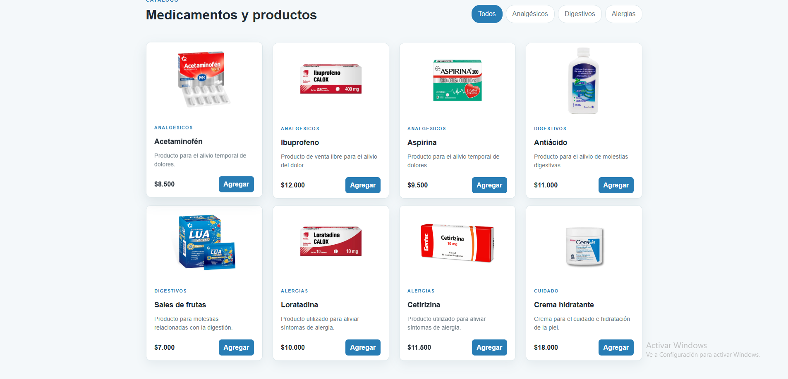
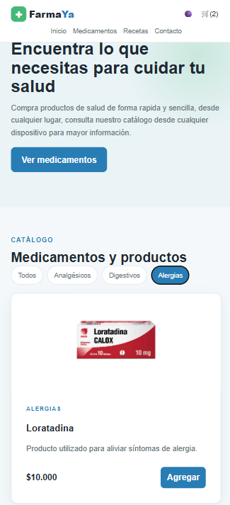
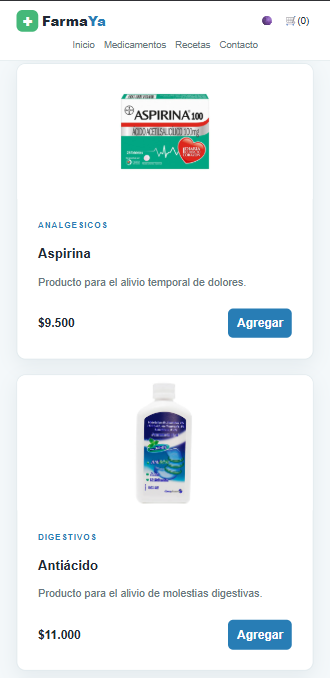
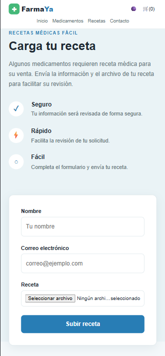
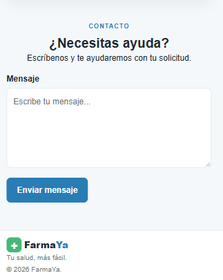

# FarmaYa

FarmaYa es una pagina web diseñada para la ventas de medicamentos
tanto de uso general como recetados, para la compra de estos ultimos
se necesitara una receta para poder comprarlos de lo contrario no
saldran en el catalogo de medicamentos.

## Tecnologías

- HTML5
- CSS3
- JavaScript
- Git
- GitHub
- Vercel

## Funcionalidades actuales

- Navegación entre secciones
- Diseño responsive
- Catalogo de productos
- Filtro de los medicamentos por categoria
- Productos generados dinámicamente con JavaScript
- Carrito de compras
- Agregar productos al carrito
- Aumentar y disminuir cantidades desde el carrito
- Eliminar productos del carrito
- Cálculo del total de productos del carrito
- Formulario para enviar recetas
- Formulario de contacto
- Validación de formularios con JavaScript
- Modo oscuro (No es un modo oscuro como tal pero funciona igual, es mas un cambio de tema, no se creo el modo oscuro porque quedaba raro con el fondo blanco de las imagenes de los medicamentos)
- Cambio de tema con `localStorage`.

## Flexbox y Grid

Se utilizó Flexbox principalmente para organizar elementos
en una misma dirección, como el encabezado, navegación,
botones y algunos elementos internos de las tarjetas.

Se utilizó CSS Grid para el catálogo de productos porque
permite organizar las tarjetas en columnas y adaptar la
cantidad de columnas dependiendo del tamaño de la pantalla.

## Responsive Design

Para el diseño responsivo se utilizo porcentajes, unidades relativas, `fr`,
`clamp()` y media queries para adaptarse a diferentes
tamaños de pantalla.

## JavaScript

JavaScript se utiliza para:

- Generar los productos.
- Filtrar productos.
- Agregar productos al carrito.
- Controlar las cantidades de productos.
- Eliminar productos del carrito.
- Calcular el total de la compra.
- Abrir y cerrar el carrito.
- Validar los formularios.
- Activar y desactivar el modo oscuro (Cambio de tema).
- Guardar la preferencia del modo oscuro utilizando Agregar productos al carrito.
- Controlar las cantidades de productos.
- Eliminar productos del carrito.
- Calcular el total de la compra.
- Abrir y cerrar el carrito.
- Validar los formularios.
- Activar y desactivar el modo oscuro.
- Guardar la preferencia del modo oscuro utilizando `localStorage`.

## explicaciones del codigo
Lógica de las funciones del proyecto

- Generación de productos (renderProducts)
Para la generación de los productos se creó una lista de objetos que contenía la información de los medicamentos
y un contenedor '

' para empaquetar todos los medicamentos.
Se usó un forEach para recorrer todos los medicamentos que había en la lista, se crea un article para cada medicamento y se devuelve un
html con la estructura de la card al div con el appendChild(). Antes de recorrer la lista se limpia el contenedor con innerHTML = ""
para que no se dupliquen las tarjetas cada vez que se vuelve a renderizar.

- Filtro de productos por categoría
Para filtrar los productos seleccione todos los botones de filtro con querySelectorAll y les agrege un addEventListener de tipo click a cada uno con
un forEach, para que cuando le dieran click a uno se quitara el "active" del actual y se pusiera en la clase del que acaba de ser presionado,
luego tomo la categoria del filto con ´const category = button.dataset.category;´ y ya solo compruebo si el filtro es el de todos o es distinto a todos
en caso de este ultimo uso un filter para tomar por los productos con la categoria seleccionada y le mando la lista con esos producto a renderProducts.

- Renderizado del carrito (renderCart)
Primero se limpia el contenedor cartItems. Si el carrito está vacío se muestra un mensaje de "carrito vacío", se pone el total en
$0 y el contador en 0, y se sale con un return. Si tiene productos, se recorre el arreglo cart con forEach y por cada item se crea
un div con la estructura de la tarjeta del carrito (imagen, nombre, precio, controles de cantidad con botones de + y −, y botón de
eliminar), usando los data-id y data-action para identificar después qué producto y qué acción se debe ejecutar. Cada tarjeta se
agrega al contenedor con appendChild(). Al final se llama a updateCartTotal() para recalcular el total y la cantidad de productos.

- Agregar producto al carrito (addToCart)
Cree un arreglo vacío llamado cart para guardar los productos agregados, la función recibe el id del producto y comprueba si
existe usando find() si el producto no existe se detiene el codigo, si el producto existe se comprueba con el metodo find()
si ya fue agregado al carrito o no, si ya esta se le aumenta 1 al quantity, si no esta se agrega al carrito con push() y se
 agrega quantity en 1 y al final se llama a renderCart() para actualizar lavista del carrito.

- Cálculo del total del carrito (updateCartTotal)
Utilice reduce() sobre cart para sumar el precio por la cantidad de cada producto y obtener el total en dinero, y otro
reduce() para sumar solo las cantidades y obtener el número total de productos.

- Abrir y cerrar el carrito
Se agregaron tres addEventListener: uno al botón del carrito (cartButton) que al hacer click le agrega la clase "active" al
overlay del carrito para mostrarlo, otro al botón de cerrar (cartClose) que le quita esa clase para ocultarlo; y otro al mismo
overlay (cartOverlay) que revisa si el click se hizo justo sobre el fondo (event.target === cartOverlay) y, si es así
cierra el carrito..

- Finalizar compra (checkoutButton)
Al hacer click en el botón de finalizar compra se valida primero si el carrito está vacío, si lo está, se muestra un alert avisando
que el carrito esta vacio agregar productos y se detiene la ejecución con un return. Si tiene productos, se muestra una alert
confirmando que la compra se realizo exitosamente.

- Cambio de tema (claro/oscuro)
Se creó la función applyTheme la cual recibe un booleano y usa classList.toggle para agregar o quitar la clase "alt-theme" al body,
además de cambiar el ícono del botón entre ☀️ y 🌑 según el estado. Al cargar la página se revisa si hay un tema guardado en
localStorage con getItem("theme") y se aplica ese tema. Al hacer click en el botón themeToggle se invierte el estado actual del
tema, se aplica con applyTheme y se guarda la elección en localStorage con setItem para que se mantenga aunque se recargue la
página.

## Uso de IA

La use para el css y el diseño de la pagina, corrección de bug/codigo que no me funcionaba
dudas con algunos metodos como el localStorage

## Capturas

### Escritorio

### Movil

## link vercel

dominio: https://tienda-ittv.vercel.app/
