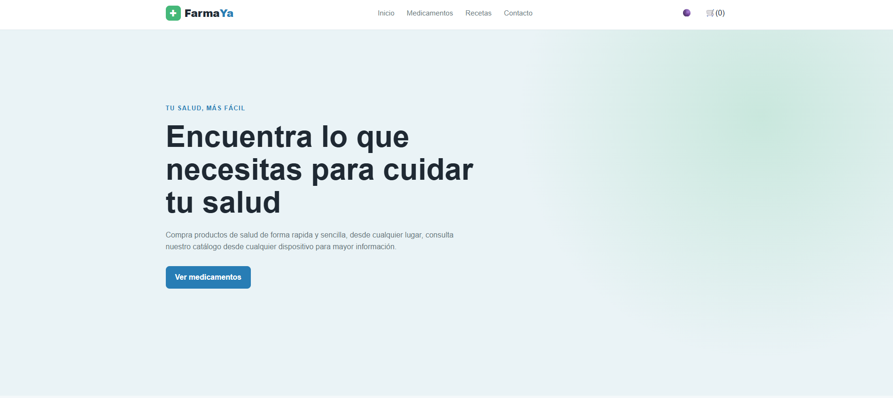
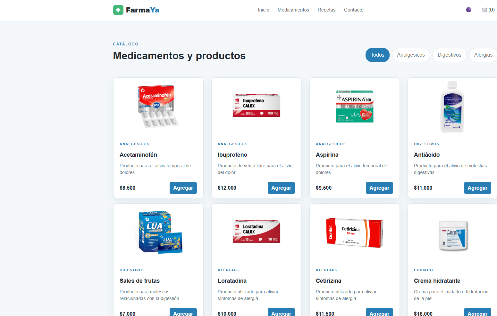
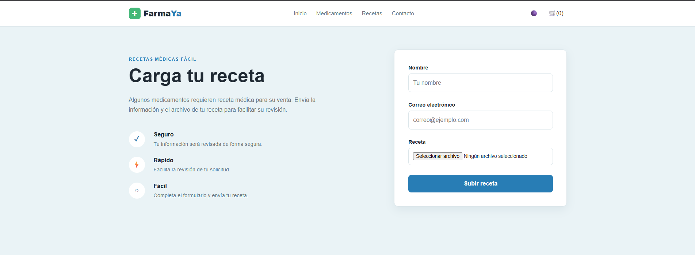
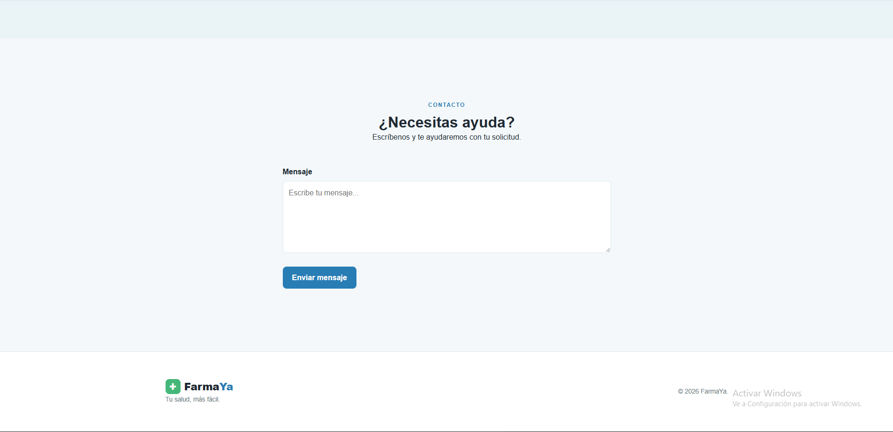

# FarmaYa

FarmaYa es una pagina web diseñada para la ventas de medicamentos
tanto de uso general como recetados, para la compra de estos ultimos
se necesitara una receta para poder comprarlos de lo contrario no
saldran en el catalogo de medicamentos.

## Tecnologías

- HTML5
- CSS3
- JavaScript
- Git
- GitHub
- Vercel

## Funcionalidades actuales

- Navegación entre secciones
- Diseño responsive
- Catalogo de productos
- Filtro de los medicamentos por categoria
- Productos generados dinámicamente con JavaScript
- Carrito de compras
- Agregar productos al carrito
- Aumentar y disminuir cantidades desde el carrito
- Eliminar productos del carrito
- Cálculo del total de productos del carrito
- Formulario para enviar recetas
- Formulario de contacto
- Validación de formularios con JavaScript
- Modo oscuro (No es modo oscuro como tal pero funciona igual, es mas un cambio de tema, no se creo el modo oscuro porque quedaba raro con el fondo blanco de las imagenes de los medicamentos)
- Cambio de tema con `localStorage`.

## Flexbox y Grid

Se utilizó Flexbox principalmente para organizar elementos
en una misma dirección, como el encabezado, navegación,
botones y algunos elementos internos de las tarjetas.

Se utilizó CSS Grid para el catálogo de productos porque
permite organizar las tarjetas en columnas y adaptar la
cantidad de columnas dependiendo del tamaño de la pantalla.

## Responsive Design

Para el diseño responsivo se utilizo porcentajes, unidades relativas, `fr`,
`clamp()` y media queries para adaptarse a diferentes
tamaños de pantalla.

## JavaScript

JavaScript se utiliza para:

- Generar los productos.
- Filtrar productos.
- Agregar productos al carrito.
- Controlar las cantidades de productos.
- Eliminar productos del carrito.
- Calcular el total de la compra.
- Abrir y cerrar el carrito.
- Validar los formularios.
- Activar y desactivar el modo oscuro (Cambio de tema).
- Guardar la preferencia del modo oscuro utilizando Agregar productos al carrito.
- Controlar las cantidades de productos.
- Eliminar productos del carrito.
- Calcular el total de la compra.
- Abrir y cerrar el carrito.
- Validar los formularios.
- Activar y desactivar el modo oscuro.
- Guardar la preferencia del modo oscuro utilizando `localStorage`.

## Uso de IA

La use para el css y el diseño de la pagina, corrección de bug/codigo que no me funcionaba
dudas con algunos metodos como el localStorage

## Capturas

### Escritorio

